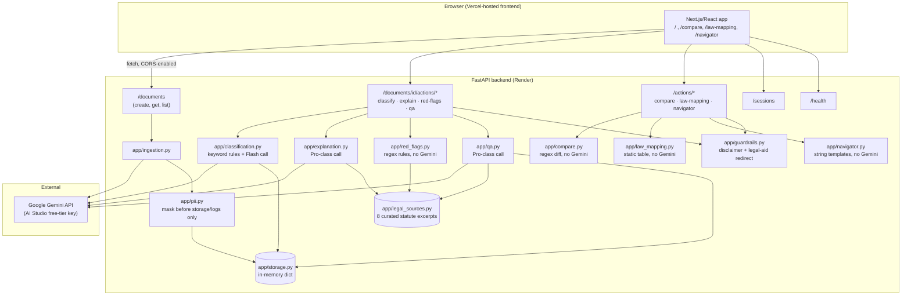
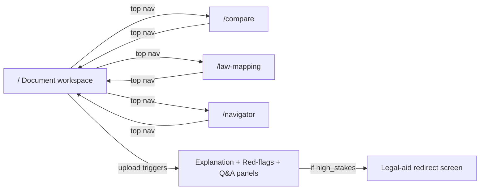

# Namma Nyaya — GenAI Legal Companion for Bengaluru

## Summary

Namma Nyaya ("Our Justice" in Kannada) is a hackathon-built ("promptwars-hackathon")
GenAI web application that lets a Bengaluru resident upload a rental
agreement or an employment offer letter, get it explained in plain language
at three levels of depth (in English and Kannada), see it checked against a
small curated set of Indian/Karnataka statutes for known red flags, compare
two documents side by side, ask cited questions about it with an honest
"I don't know" fallback, look up old-to-new criminal-law section mappings
(IPC/CrPC/Evidence Act → BNS/BNSS/BSA), and generate a "what do I do now"
action playbook (a draft legal notice or RERA complaint) for two specific
situations. It exists because generic legal-document simplifiers are not
localized to Karnataka law, Kannada language, or Bengaluru's specific mix of
migrant tech workers, first-time home buyers, gig workers and others — this
build is the narrow MVP vertical slice (rental agreements + offer letters,
for migrant tech professionals) chosen out of that much larger vision. The
system is a Python/FastAPI backend (deliberately channel-agnostic,
resource-oriented under `/documents`, `/sessions`, `/actions` so a future
non-web channel could be added later) plus a Next.js/React frontend, both
already deployed and live (backend on Render, frontend on Vercel, confirmed
responding as of this run), using Google's Gemini API for document
ingestion/OCR, classification, explanation, and Q&A. It carries real,
currently-unresolved operational risk for a live demo: the free-tier Gemini
key is capped at 20 requests/day per model, and the "pro" model is currently
pointed at the same model as "flash" as a workaround for a 429 quota error —
both documented below, not smoothed over.

## Sources consulted

**Actual project code/config read this run:**
- `backend/app/main.py`, `config.py`, `models.py`, `storage.py`, `gemini_client.py`
- `backend/app/ingestion.py`, `classification.py`, `explanation.py`, `red_flags.py`, `compare.py`, `qa.py`, `law_mapping.py`, `navigator.py`, `guardrails.py`, `pii.py`, `legal_sources.py`
- `backend/app/routers/health.py`, `sessions.py`, `documents.py`, `actions.py`
- `backend/requirements.txt`, `backend/README.md`, `backend/docs/c4_ocr_spike_log.md`
- `backend/tests/*.py` (test file inventory and function count, 30 tests confirmed)
- `backend/.env` (local secrets file — read only to confirm current model-name/mock-mode config, key value not reproduced here)
- `frontend/app/page.tsx`, `layout.tsx`, `compare/page.tsx`, `law-mapping/page.tsx`, `navigator/page.tsx`
- `frontend/components/TopNav.tsx`, `DisclaimerBanner.tsx`, `DocumentUpload.tsx`, `ExplanationPanel.tsx`, `QAPanel.tsx`, `RedFlagList.tsx`, `LegalAidRedirect.tsx`, `LanguageToggle.tsx`
- `frontend/lib/api.ts`, `frontend/package.json`, `frontend/README.md`
- `render.yaml` (repo root), root `README.md`
- Live check this run: `GET https://namma-nyaya-backend.onrender.com/health` → 200; `GET https://namma-nyaya-frontend.vercel.app` → 200 (both confirmed live at time of writing)

**`.squad/` planning docs read as supplementary context (all for slug `namma-nyaya`):**
- `.squad/specification/namma-nyaya.md` (why/what, MVP scope, six user segments)
- `.squad/planner/namma-nyaya.md` (locked build-approach decisions: Gemini, Python/FastAPI + Next.js, context-stuffing, Render+Vercel)
- `.squad/task/namma-nyaya.md` (C1-C24 coder tasks, D1-D12 deploy tasks)
- `.squad/coder/namma-nyaya.md` (coder status report — predates the live model-name fixes and quota discovery, see Discrepancies below)
- `.squad/deploy/namma-nyaya.md` (deploy status report, including the post-deploy live-fix log — this is the most current and most reliable planning artifact, since it was written after live debugging)
- No `.squad/designer/namma-nyaya.md` exists for this slug, so screens below are derived directly from the actual frontend code rather than a prior wireframe spec.

No `drawio` MCP server was connected in this run, so no `.squad/doc/namma-nyaya.drawio` file was produced — see the Architecture and Screens sections for Mermaid-only diagrams instead.

## Who

Primary target user (per the specification, matched by the actual feature
set built): a **migrant tech professional in Bengaluru** — someone renting
their first apartment in the city and/or signing their first Indian
employment offer letter, who is not fluent in reading dense legal English,
may not read Kannada well (or vice versa, if a landlord's agreement is in
Kannada), and has no easy access to a lawyer for a routine document review.

The wider specification names five other Bengaluru population segments
(first-time home buyers, gig/delivery/auto/domestic workers, senior
citizens/families, small businesses, apartment/RWA residents) as the
long-term target audience, but **none of that broader coverage is built** —
the code only handles rental agreements and offer letters, confirming the
spec's own MVP scoping decision was followed.

## What

The live product lets a user, through a web app:

1. **Upload** a rental agreement or offer letter as a PDF or image (`POST /documents`), which is sent directly to Gemini for text extraction (no separate OCR service).
2. **Classify** the document type (rental agreement vs. offer letter) and screen it for high-stakes situations (arrest, criminal charge, custody, divorce, large property value) via deterministic keyword rules.
3. **Read a three-level explanation** — one-line gist, clause-by-clause plain language, and a "legal view" with citations — toggle-able between English and Kannada.
4. **See red flags** for five specific, spec-named categories: oversized security deposits, unconditional painting/cleaning deductions, tenant/landlord notice-period asymmetry, unenforceable non-compete clauses (Indian Contract Act s.27), and disproportionate training-bond amounts — each deterministically detected via regex and each carrying a real citation into a curated 8-source legal excerpt set.
5. **Compare two documents** side by side on deposit amount, notice periods, lock-in months, and employee notice, with differing fields highlighted.
6. **Ask a cited question** about the document and get an answer with a citation and a rule-based High/Medium/Low confidence label, or an explicit "I don't know" when nothing in the curated source set supports an answer.
7. **Look up old↔new criminal-law section numbers** (IPC/CrPC/Evidence Act ↔ BNS/BNSS/BSA), independent of any uploaded document — 20 seeded mappings.
8. **Run a navigator playbook** for one of two situations — "security deposit not returned" or "builder possession delay (RERA)" — and download a generated draft legal notice / K-RERA complaint, plus a document checklist, forum, timeline, and rough cost.
9. **See a standing disclaimer** ("information, not advice") on every page, and be redirected to a legal-aid message (KSLSA/DLSA/NALSA helpline 15100) instead of substantive content whenever a document is flagged high-stakes.

## Why

The specification's stated problem: generic AI legal-document tools don't
know Karnataka-specific norms (deposit conventions, the Karnataka Rent Act
framework, the Karnataka Shops and Commercial Establishments Act), don't
handle Kannada or code-mixed Kannada/English text, and stop at "here's what
this document says" without telling a user the concrete next step (which
forum, which document, how long, how much). Bengaluru's unusually mixed
population (a large migrant tech workforce specifically) faces this gap
acutely for the two document types almost everyone in that group signs:
a rental agreement and a job offer letter. The 2023-24 replacement of
IPC/CrPC/Evidence Act with BNS/BNSS/BSA is a second, narrower but concrete
motivation named in the spec — most public references still use the old
section numbers, creating a standalone need for a lookup tool. The actual
code matches this motivation closely: the red-flag rules, the curated
8-source legal set, and the two navigator playbooks are all scoped
precisely to rental-agreement/offer-letter pain points named in the spec,
not a generic "explain any contract" tool.

## How it's used

### End-user usage (live)

1. Visit https://namma-nyaya-frontend.vercel.app.
2. On the home page (`/`), upload a rental agreement or offer letter (PDF/PNG/JPEG/WebP).
3. The app automatically classifies it, then fetches and displays the three-level explanation and the red-flag list side by side with the original masked document text.
4. Toggle English/Kannada and gist/clause-by-clause/legal-view.
5. Ask questions in the Q&A panel underneath the explanation.
6. Navigate via the top nav to `/compare` (upload a second document to diff against), `/law-mapping` (standalone section lookup), or `/navigator` (pick a playbook, fill in a few facts, download the generated draft).
7. If a document trips a high-stakes keyword, every panel that would normally show substantive content instead shows the legal-aid redirect message.

Note: Render's free tier spins the backend down after ~15 minutes idle, so
the very first request after a period of inactivity (including a judge
reopening the link days later) takes roughly 30-50 seconds to respond
before the app becomes responsive — confirmed in `.squad/deploy/namma-nyaya.md`
and consistent with Render's documented free-tier behavior.

### Developer/operator usage (verified against the actual repo)

**Local run (offline mock mode, no API key needed):**
```bash
# Backend
cd backend
python -m venv .venv && ./.venv/Scripts/activate
pip install -r requirements.txt
cp .env.example .env
uvicorn app.main:app --reload --port 8000

# Frontend
cd frontend
npm install
cp .env.local.example .env.local
npm run dev
```
Then open http://localhost:3000. `GEMINI_MOCK_MODE` defaults to true (and is
force-enabled whenever no API key is present), so every Gemini-backed
response is a clearly-labeled deterministic mock in this mode.

**Tests:** `pytest -q` from `backend/` — 30 tests pass (confirmed by direct
inspection of `backend/tests/*.py`: `test_health.py` (2), `test_pii.py` (4),
`test_law_mapping.py` (5), `test_documents_flow.py` (10), `test_actions.py`
(9)). All run against mock mode; none exercise a live Gemini call.

**Frontend build/lint:** `npm run build`, `npm run lint` — both reported
clean by the coder lane.

**Live deploy (already provisioned, per `.squad/deploy/namma-nyaya.md` and
confirmed live in this run):**
- Backend: Render web service, defined by `render.yaml` at the repo root (Python runtime, `rootDir: backend`, `uvicorn app.main:app`, free plan, `PYTHON_VERSION=3.12.7` pinned to get a prebuilt `pydantic-core` wheel).
- Frontend: Vercel project (`frontend/vercel.json`), pointed at the Render backend via `NEXT_PUBLIC_API_BASE_URL`.
- Secrets (`GEMINI_API_KEY`, `CORS_ALLOWED_ORIGINS`) are set directly in each platform's dashboard, never committed — `render.yaml` marks them `sync: false` deliberately.
- Both platforms auto-deploy on push to `main`.

## Architecture

**Real tech stack** (confirmed from `requirements.txt` / `package.json`):
FastAPI 0.115 + Pydantic 2.9 + `google-genai` 0.3.0 on the backend (Python);
Next.js 14.2.35 (App Router) + React 18.3.1 + TypeScript on the frontend.
Storage is in-memory only (`backend/app/storage.py`, a process-local dict
keyed by UUID) — documents and sessions do not survive a process
restart or a Render cold-start recycle; this is a documented, accepted POC
limitation, not a bug. No vector database is used: the curated 8-source
legal excerpt set (`app/legal_sources.py`) is context-stuffed directly into
Gemini prompts, per the planner's locked decision.

**Data flow for the core document journey:**
1. Browser uploads a file to `POST /documents`.
2. `app/ingestion.py` sends the raw bytes straight to Gemini's multimodal endpoint (`call_pro_multimodal`) with an extraction prompt — Gemini itself performs OCR/transcription, no separate OCR API.
3. `app/pii.py` masks Aadhaar/PAN-shaped patterns in the extracted text — **after** the Gemini call, immediately before persistence. Raw content (including any embedded PII) still reaches Gemini in-flight; this is a documented, accepted POC-level limitation, not an oversight.
4. The masked text is stored in-memory (`app/storage.py`) and a document ID is returned.
5. `app/classification.py` (deterministic keyword rules, backed by a Flash-class Gemini call for a human-readable rationale only) sets `document_type` and `high_stakes`.
6. If not high-stakes, `app/explanation.py`, `app/red_flags.py`, and `app/qa.py` each independently combine the document's masked text with the curated legal-source block and either a Pro-class Gemini call (explanation, Q&A) or pure regex rules (red-flags) to produce their response. Citations are always computed deterministically against `CURATED_SOURCES` IDs, never parsed from free-form model text — this structurally prevents fabricated citations regardless of live/mock mode.
7. If high-stakes, `app/guardrails.py` substitutes the legal-aid redirect message for all of the above.
8. `app/compare.py`, `app/law_mapping.py`, and `app/navigator.py` are standalone `/actions/*` routes independent of the classify/explain chain — law-mapping and navigator have no Gemini dependency at all (pure lookup table / string templates), which is why they are the only endpoints verified fully working end-to-end against the live deployment (per the deploy report).



No `.squad/doc/namma-nyaya.drawio` file exists — the `drawio` MCP server was
not connected in this run, so this Mermaid diagram is the only architecture
diagram produced.

## Screens / wireframes

No `.squad/designer/namma-nyaya.md` exists for this slug, so the screen
inventory below is derived directly from the actual frontend route/component
code (`frontend/app/*`, `frontend/components/*`), not a prior wireframe spec.

**Global:** every page renders `TopNav` (Document / Compare / Law Mapping /
Navigator links) and `DisclaimerBanner` (standing "information, not advice"
text) at the top.

### 1. Document workspace (`/`)

```
+--------------------------------------------------------------+
| Namma Nyaya   Document  Compare  Law Mapping  Navigator       |
+--------------------------------------------------------------+
| [ disclaimer banner: "information, not advice" ]              |
| Backend health: ok                                            |
| [ Upload file ]                                                |
+---------------------------+------------------------------------+
| DOCUMENT                  | EXPLANATION                        |
| filename (doc type)       | [English|Kannada] [gist|clause|legal]|
| ---- masked text ----     | <selected level text>              |
|                           | Citations: contract-act-s27, ...   |
| RED FLAGS                 | ------------------------------------|
| [high] deposit_size ...   | ASK A QUESTION                     |
| [med]  lock_in_asymmetry  | [ input ][ Ask ]                   |
|                           | Q: ...  A: ... Citation: ...        |
|                           | Confidence: High/Medium/Low          |
|                           | (or) "I don't know" — dashed/italic |
+---------------------------+------------------------------------+
```
If the document is flagged high-stakes, the explanation and Q&A panels are
replaced in place by `LegalAidRedirect` (KSLSA/DLSA/NALSA message) instead
of substantive content — confirmed in `ExplanationPanel.tsx` and
`QAPanel.tsx`.

### 2. Compare (`/compare`)

```
+--------------------------------------------------------------+
| Compare documents                                             |
+---------------------------+------------------------------------+
| Document A                | Document B                         |
| [ Upload ]                | [ Upload ]                          |
+---------------------------+------------------------------------+
| [ Compare ]                                                    |
| Field              | Doc A | Doc B | Red-flag category         |
| security_deposit... |  10   |   2   | deposit_size              |
| tenant_notice...     |   3   |   1   | lock_in_asymmetry         |
+--------------------------------------------------------------+
```

### 3. Law mapping (`/law-mapping`)

```
+--------------------------------------------------------------+
| IPC/CrPC/Evidence Act <-> BNS/BNSS/BSA lookup                 |
| [ Section: 302 ] [ Code (optional) ] [ Look up ]              |
| IPC 302 <-> BNS 103 — Punishment for murder                   |
+--------------------------------------------------------------+
```
Standalone — no document upload involved, confirmed against `law_mapping.py`.

### 4. Navigator (`/navigator`)

```
+--------------------------------------------------------------+
| Navigator — what do I do now?                                 |
| [Security deposit not returned] [Builder possession delay]    |
+--------------------------------------------------------------+
| <description>                                                  |
| [ tenant/buyer name ] [ landlord/builder name ] [ amount ]     |
| [ Generate playbook ]                                          |
+--------------------------------------------------------------+
| Forum: ...   Timeline: ...   Cost: ...                         |
| Required documents: - ... - ...                                |
| Generated draft: <legal notice / K-RERA complaint text>        |
| [ Download draft ]                                              |
+--------------------------------------------------------------+
```



No `.squad/doc/namma-nyaya.drawio` file exists for this diagram either —
same reason (drawio MCP server not connected this run).

## Discrepancies found

- **`.squad/coder/namma-nyaya.md` is stale on several live-fixed points.**
  It reports Gemini calls as entirely unverified (no key available) and
  models still configured as `gemini-2.5-flash`/`gemini-2.5-pro`. The actual
  code and `.env`/`render.yaml` now use `gemini-3.6-flash` for both the flash
  and pro tiers (the 2.5-series models are retired for new users, and
  `gemini-pro-latest` — the real intended pro model — returns 429 quota
  errors on this free-tier key). The coder report also doesn't mention the
  retry-with-backoff logic in `gemini_client.py`, which was added later
  during live deploy debugging. `.squad/deploy/namma-nyaya.md`'s later,
  post-fix entries are the accurate current record — this doc follows the
  deploy report and the code itself over the earlier coder report.
- **Planner's model-tier strategy is not actually realized in production
  right now.** `.squad/planner/namma-nyaya.md` calls for a genuine
  Flash/Pro tiered strategy ("Pro-class" for explanation/red-flag/Q&A
  quality). In the live/current config, `GEMINI_PRO_MODEL` is set to the
  same value as `GEMINI_FLASH_MODEL` (`gemini-3.6-flash`) — confirmed
  directly in `backend/.env` and `render.yaml` — because the real pro
  model has effectively zero free-tier quota without billing. So today's
  live deployment runs on a single flash-tier model for everything, not
  the two-tier strategy the plan describes. This is documented in-code as
  an accepted pragmatic workaround, not a silent gap.
- **C4 (Kannada OCR go/no-go spike) was never completed as specified.**
  The task breakdown required 5-10 real sample documents including 2+
  low-quality scans and a human-reference-transcription accuracy check. What
  actually happened (confirmed in `backend/docs/c4_ocr_spike_log.md`) is a
  single ad hoc test against one synthetic, clean, computer-rendered
  image — a real positive signal for basic capability, but explicitly *not*
  a completed go/no-go per the original protocol. Both the coder and deploy
  reports are honest about this gap, and this doc preserves that honesty
  rather than upgrading it to "validated."
- **Coder report frames C24 (end-to-end demo rehearsal) as done "at the API
  level," but the deploy report's later live testing found and fixed a
  genuine end-to-end bug** (missing retry/error handling causing bare 500s
  on transient Gemini 503s) that the coder-lane's 30 offline tests could not
  have caught, since they never exercise the live Gemini path. This confirms
  the coder lane's own caveat that live-mode behavior was unverified was the
  correct call, not overly cautious hedging.
- **The planner's PII-masking decision (masking before storage/logs only,
  not before the outbound Gemini call) is exactly what the code does** —
  no discrepancy here, called out only because it's easy to assume a
  "PII masking module" means full masking; `app/pii.py`'s own docstring and
  the `documents.py` router comment both confirm the narrower scope
  matches the plan precisely.

## Open questions

- **Free-tier Gemini quota (20 requests/day/model) is an unresolved,
  demo-blocking risk**, per `.squad/deploy/namma-nyaya.md`'s own explicit
  "BLOCKING FINDING." A single full user walkthrough (upload, classify,
  explain in two languages, red-flags, one Q&A question) can cost 5-10+
  requests on its own, and a single failed ingestion attempt can cost up to
  5 more due to the retry logic. As of the last deploy-lane update, the
  team chose to wait for the daily quota reset rather than enable billing —
  it is unclear from any artifact read this run whether billing has since
  been enabled or a fresh key obtained. This should be resolved and
  re-verified before any live judging session.
- **Kannada OCR on a real scanned/photographed document remains
  unvalidated.** The one positive signal is against a clean synthetic image
  with a rendered font, not a real physical document (stamp paper,
  handwriting, phone-camera skew/glare, low resolution). No artifact read
  this run indicates this gap has since been closed.
- **Whether the pro-tier model workaround (`GEMINI_PRO_MODEL` = the flash
  model) has since been reverted** once/if billing was enabled is unknown —
  the `.env`/`render.yaml` snapshot read this run still shows the
  workaround in place.
- **No automated frontend test suite exists** (confirmed absent in
  `frontend/`) — the only frontend verification on record is `npm run
  build`/`npm run lint` plus a manual local run; a full interactive
  browser click-through of the live deployed frontend has not been
  recorded in any artifact read this run.
- **D11 (post-judging idle/wake persistence check) and D12 (team
  acknowledgment of the Streamlit/Gradio fallback plan)** are both recorded
  as still outstanding in `.squad/deploy/namma-nyaya.md` — no later artifact
  confirms either was completed.

## Status

Draft — 2026-09-24
